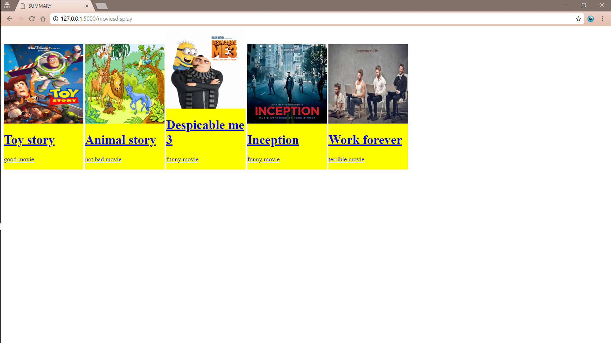
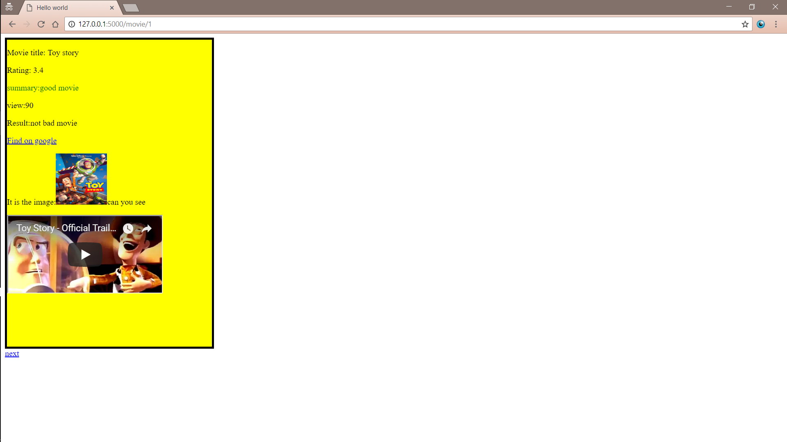

# This repository is a sample learning project to teach myself Python with Flask backend development

## Running
If you have flask installed, run `export FLASK_RUN=hello.py` and `flask run`
Otherwise
```
python hello.py
```
And then open the browser and head to `127.0.0.1:5000`
## Screenshots:

Movies display
`/moviesdisplay`


Single movie`/movies/1`

